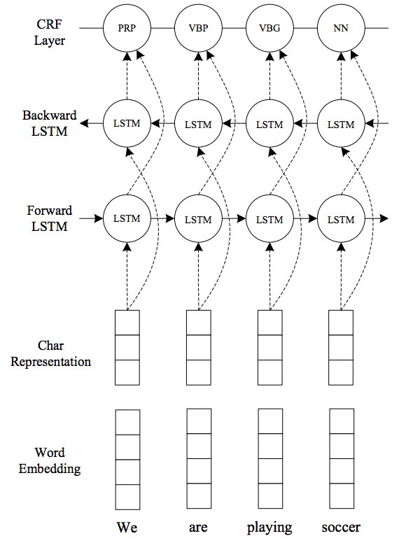

# pytorch-sequence-tagger
This repo will try to build model that is used for sequence tagging (POS Tag, NER, etc.). The implementation is following the experiment of [1]. The model is a combination between embedding, LSTM and CRF. The architecture shown as the following



The difference between the above architecture and the one that implemented on this exercise is before CRF layer linear projection is added in order to map existing result from Bi-LSTM layer to the size of tags.

* The embedding used by this architeture is a combination between word embedding and character embedding. There are two types of character embedding available on this repository, one is lstm from [3] and cnn from [2]. According to [2], convolutional layer combined with max pooling is able to capture morphological feature between characters. Another experiment in [3], although the model that is employed is different (using LSTM to extract character level feature), the idea to use character-level based helps to make the model more robust while handling OOV in low resource language.
* The architecture that is used in this exercise is Bi-LSTM. Bi-LSTM is almost a go-to architecture in solving NLP problems. It works by traversing over the sentence in forward and backward manners and combining the vectors resulted from those two.
* Thanks to Bi-LSTM, at every timestep `t` we are able to get `h` which is a combination between current word `t` and its surrounding (context). However, the tags decision that made relying on the output of Bi-LSTM only is still considered local. Therefore, CRF is employed on this exercise to mitigate the aforementioned local decision.
* Several weights and bias initialization are conducted in RNN, embedding and linear layer. Most of them are using xavier initialization based on empirical observation while tuning the model.

## How to Run?
### Data Preparation
Within the same folder as this answer, please put the data inside `data/` folder. Your data must have `<dataset_name>.[dev|train|test].csv` format. For example `conll.dev.csv`. All three must exist before you run the training phase.

Below is the example of the data format
```
sentece,tags
CRICKET - LEICESTERSHIRE TAKE OVER AT TOP AFTER INNINGS VICTORY ., O O I-ORG O O O O O O O O
```

### Installation
1. Ensure you have python3.6 installed on your device.
2. Run `pip install -r requirements.txt` to install the dependencies.

### Training and Validation
Run `python train.py` with the following arguments:
```
optional arguments:
  -h, --help            show this help message and exit
  --batch_size BATCH_SIZE
                        Number of batch in single iteration
  --dataset_path DATASET_PATH
                        Path for source training data. Ex: data/train.en
  --max_epochs MAX_EPOCHS
                        Number of epochs
  --model_config MODEL_CONFIG
                        Location of model config
  --learning_rate LEARNING_RATE
                        Learning rate size
  --log_interval LOG_INTERVAL
                        Print loss for every N steps
  --save_interval SAVE_INTERVAL
                        Save model for every N steps
  --restore_nth_model RESTORE_NTH_MODEL
                        Restore the nth model saved on model_path. The valid
                        values are string `latest`, and numbers (1, 2, 3, ...)
  --early_stopping_patience EARLY_STOPPING_PATIENCE
                        The number of patience required for early stopping
  --num_retained_models NUM_RETAINED_MODELS
                        Number of models retained for checkpoint
  --model_path MODEL_PATH
                        Location to save the model
```

### Configuration
In order to run the training phase, one need to prepare configuration file with the following format
```
embedding:
  embedding_type: ["lstm"|"cnn"]
  word_embedding_size: <int>
  char_embedding_size: <int>
  embedding_dropout: <float>
  output_size: <int>
  char_lstm_layers: <int>
  char_lstm_dropout: <float>
  pretrained: [null|string from [here](https://github.com/pytorch/text/blob/master/torchtext/vocab.py)
tagger:
  hidden_size: <int>
  layer_size: <int>
  rnn_dropout: <float>
```
Examples can bee seen under `config/`

# Reference
1. https://arxiv.org/pdf/1603.01354.pdf
2. http://aclweb.org/anthology/D15-1025
3. https://arxiv.org/pdf/1805.12291.pdf